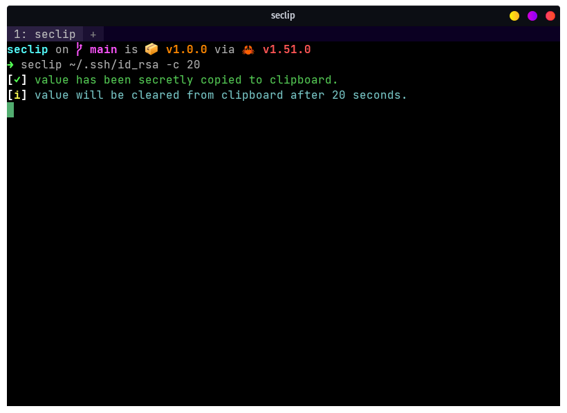

# `seclip` :lock::memo:

A CLI utility to secretly copy secrets to your clipboard. :crab:

[](https://crates.io/crates/seclip)
[](https://github.com/mufeedvh/seclip/blob/master/LICENSE)
[](https://twitter.com/intent/tweet?text=seclip%20-%20A%20CLI%20utility%20to%20secretly%20copy%20secrets%20to%20clipboard:&url=https%3A%2F%2Fgithub.com%2Fmufeedvh%2Fseclip)

<h1 align="center">
  <a href="https://github.com/mufeedvh/seclip"></a>
</h1>

## Table of Contents

* [Features](#features)
* [Installation](#installation)
* [Usage](#usage)
* [Build From Source](#build-from-source)
* [Contribution](#contribution)
* [License](#license)
* [Support The Author](#liked-the-project)

## Features

- **Cross-platform**.
- Copy secret values from files. (`ssh key`, `pgp key`, `github/gitlab token`, `private keys`, etc.)
- Copy secret values from environment variables.
- **Self-destruct:** Automatically clear clipboard after a given timeout.

## Installation

Download the latest binary for your OS and architecture from [Releases](https://github.com/mufeedvh/seclip/releases) OR install with `cargo`:

    $ cargo install seclip

## Usage

Get utility info and the list of all the arguments:

    $ seclip -h

Copy a value from a file

    $ seclip ~/.ssh/id_rsa

Copy a value from environment variable

    $ seclip ENV_VAR

Copy a value and self-destruct the value from clipboard after a given timeout (in seconds) **(-c/--clear)**

    $ seclip ~/.ssh/id_rsa -c 20

## How is it useful?

When working in shared environments, sharing your screen, or you're at a public place, reading secret tokens could expose it to prying eyes, that's where `seclip` can help you. Just give the path to the private key or the environment variable, the secret value will be copied to your clipboard. In instances where you might forget that you copied a secret value, you can use the `-c` / `--clear` feature to automatically clear your clipboard in a given time.

You can also use this as a fast shortcut to copy any file contents to clipboard!

## Build From Source

### Prerequisites

On Linux you'll need the `xcb`, `xcb-render`, `xcb-shape`, and `xcb-xfixes` X11 libraries at compile time. On Ubuntu, you can install these with

```bash
sudo apt-get install libxcb1-dev libxcb-render0-dev libxcb-shape0-dev libxcb-xfixes0-dev
```

For building `seclip` from source, you need to have these tools installed

* [Git](https://git-scm.org/downloads)
* [Rust](https://rust-lang.org/tools/install)
* Cargo (Automatically installed when installing Rust)
* A C linker (Only for Linux, generally comes pre-installed)

```
$ git clone https://github.com/mufeedvh/seclip.git
$ cd seclip/
$ cargo build --release
```

The first command clones the seclip repository in your local machine. The next two commands changes into the seclip directory and builds it in release mode.

## Contribution

Ways to contribute
- Suggest a feature
- Report a bug
- Fix something and open a pull request
- Help me document the code
- Spread the word

## License

Licensed under the MIT License, see <a href="https://github.com/mufeedvh/seclip/blob/master/LICENSE">LICENSE</a> for more information.

## Liked the project?

Support the author by buying him a coffee!

<a href="https://www.buymeacoffee.com/mufeedvh" target="_blank"></a>

----

***Support this project by starring ⭐, sharing 📲, and contributing 👩‍💻! :heart:***